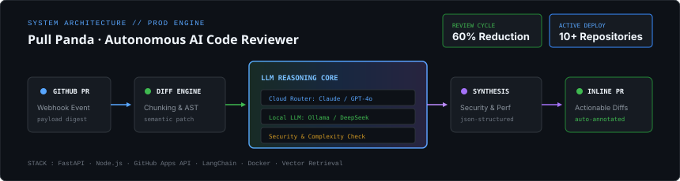

# Pull Panda 🐼

> **Autonomous AI-Powered Code Review Engine for GitHub Pull Requests**  
> *Extracts AST diffs, orchestrates multi-tier LLM reasoning, and posts structured, line-precise comments directly on GitHub PRs.*

<br>

<div align="center">
  
</div>

<br>

---

## ⚡ Overview

**Pull Panda** is an intelligent developer infrastructure tool built to automate first-level code reviews on GitHub Pull Requests. By intercepting GitHub webhook events, extracting semantic diff chunks, and orchestrating context-aware LLMs (Claude, GPT-4o, and local Ollama instances), Pull Panda detects logical bugs, security vulnerabilities, performance anti-patterns, and architectural regressions before human review.

### 🎯 Key Impact
- **60% Turnaround Reduction:** Automates routine syntax, security, and edge-case sanity checks within seconds of PR creation.
- **Privacy-First Hybrid Execution:** Route sensitive proprietary codebases through local self-hosted models (Ollama/DeepSeek) or high-throughput cloud endpoints.
- **Zero Hallucination Anchoring:** Employs AST-aware chunking to map feedback directly to valid diff hunks, preventing disjointed comments.

---

## 🧠 Core Architecture & Inference Pipeline

The review engine is structured across 5 decoupled stages:

1. **GitHub Webhook Ingestion:** Listens to `pull_request.opened` and `pull_request.synchronize` events via secure HMAC-SHA256 authenticated endpoints.
2. **Diff & AST Extraction:** Deconstructs git diffs into unified patches, parses file-level syntax trees, and isolates changed scopes (functions, classes, dependencies).
3. **Multi-Model LLM Reasoning Core:**
   - **Cloud Router:** Prompts high-reasoning models (Claude 3.5 Sonnet, GPT-4o) for high-complexity architectural reviews.
   - **Local Inference Router:** Integrates with local Ollama daemons (e.g., DeepSeek-Coder, Llama 3) for zero-data-leakage enterprise environments.
   - **Fine-Tuned Evaluator:** Custom LoRA adapter trained on real-world code reviews to enforce consistent stylistic and engineering standards.
4. **Review Synthesizer & Validator:** Validates LLM output against strict JSON schemas, enforces confidence thresholds, and filters noise or speculative suggestions.
5. **Inline PR Annotation:** Interacts with GitHub REST/GraphQL APIs to place multi-line markdown comments on exact modified line indices.

---

## 🛠️ Tech Stack

| Layer | Technologies |
|:---|:---|
| **Backend & APIs** | FastAPI, Python 3.11, Uvicorn, Node.js |
| **LLM & Agent Framework** | LangChain, Ollama, OpenAI API, Anthropic SDK, LoRA / PEFT |
| **GitHub Integration** | GitHub Apps API, Webhooks, PyGithub, Octokit |
| **Data & Storage** | PostgreSQL, SQLite, Vector Stores (FAISS/ChromaDB) |
| **Infrastructure** | Docker, GitHub Actions, Linux |

---

## 🚀 Quick Start

### 1. Prerequisites
- Python 3.10+ installed
- GitHub Personal Access Token or GitHub App credentials
- (Optional) [Ollama](https://ollama.com/) running locally for private offline inference

### 2. Installation & Setup

Clone the repository and install dependencies:

```bash
git clone https://github.com/prince-chovatiya01/PULL-PANDA.git
cd PULL-PANDA
python -m venv venv
source venv/bin/activate  # On Windows: .\venv\Scripts\activate
pip install -r requirements.txt
```

### 3. Environment Configuration

Create a `.env` file in the root directory:

```env
# GitHub Configuration
GITHUB_TOKEN=ghp_your_personal_access_token_here
GITHUB_WEBHOOK_SECRET=your_webhook_hmac_secret

# LLM Providers (Cloud)
OPENAI_API_KEY=sk-...
ANTHROPIC_API_KEY=sk-ant-...

# Local Inference (Optional)
USE_LOCAL_LLM=false
OLLAMA_BASE_URL=http://localhost:11434
OLLAMA_MODEL=deepseek-coder:6.7b
```

### 4. Running the Review Server

Start the FastAPI webhook listener:

```bash
uvicorn main:app --host 0.0.0.0 --port 8000 --reload
```

For local webhook forwarding during development, expose your local port with ngrok or smee.io:

```bash
smee -u https://smee.io/your-channel -t http://localhost:8000/webhook
```

---

## 📁 Repository Structure

```
├── assets/                  # Architecture diagrams & visual assets
├── core/
│   ├── ast_parser.py        # Syntax tree chunking & patch extraction
│   ├── diff_extractor.py    # Git diff isolation & parsing
│   └── validator.py         # JSON schema validation for model outputs
├── models/
│   ├── cloud_router.py      # OpenAI & Anthropic API orchestration
│   ├── local_router.py      # Ollama local inference integration
│   └── lora_finetune.py     # Parameter-efficient fine-tuning scripts
├── webhooks/
│   ├── github_handler.py    # GitHub webhook event dispatcher
│   └── annotator.py         # GitHub API inline comment poster
├── main.py                  # FastAPI application entrypoint
├── requirements.txt         # Project dependencies
└── README.md                # System documentation
```

---

## 🗺️ Roadmap & Milestones

- [x] **Phase 1:** Core webhook ingestion & basic cloud LLM review generation
- [x] **Phase 2:** AST-based diff chunking and inline GitHub PR annotations
- [x] **Phase 3:** Local Ollama integration for air-gapped / private inference
- [x] **Phase 4:** Custom LoRA fine-tuning pipeline on synthetic review pairs
- [ ] **Phase 5:** Multi-file semantic RAG indexing across full repository context
- [ ] **Phase 6:** Web-based telemetry dashboard for review metrics and latency tracking

---

## 📄 License

Distributed under the MIT License. See `LICENSE` for more information.

---

<p align="center">
  <sub>Engineered by <a href="https://github.com/prince-chovatiya01">Prince Chovatiya</a></sub>
</p>
